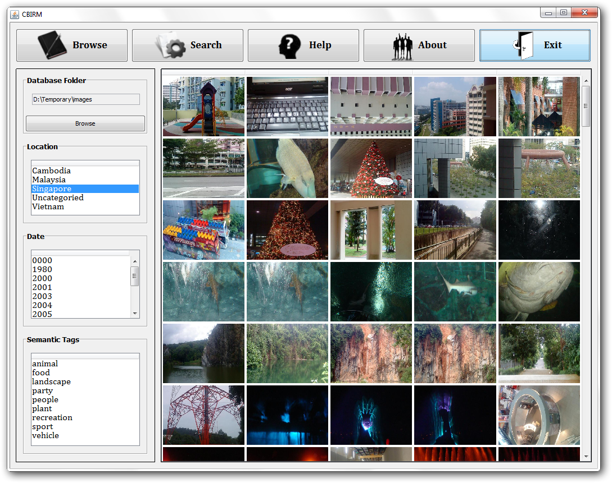

<h1 align="center">
  

  <p align="center">CBIRM - Content-Based Image Retrieval and Management</p>
</h1>

## Table of Contents

- [Features](#features)
- [Development](#development)
    - [Requirements](#requirements)
    - [Build](#build)
- [Authors](#authors)

## Features

- Organize images based on following categories
    - Geolocation
    - Datetime
    - EXIF tags
- Search iamges based on following features
    - Geolocation
    - Datetime
    - EXIF tags
    - Image content features (Color Histogram, Color Coherence Vector, Color Correlogram and Edge Detection)

## Development

### Requirements

- JDK 21+

### Build

```shell
./gradlew clean build
```

## Authors

- Binh-Nguyen "Ben" Tran
- Xuan-Bach Le
- Zhilong Huang
